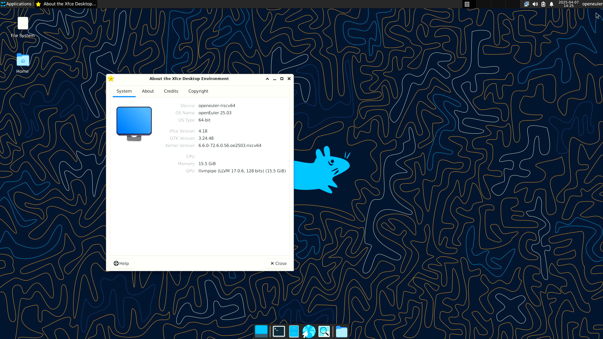

# openEuler RISC-V 25.03 LPi4A 版本测试报告

## 测试环境

### 操作系统信息

- 系统版本：openEuler 25.03
- 下载链接：https://repo.openeuler.org/openEuler-25.03/embedded_img/riscv64/lpi4a/
- 参考安装文档：https://docs.openeuler.org/zh/docs/24.03_LTS/docs/Installation/RISC-V-LicheePi4A.html

### 硬件信息

- Lichee Pi 4A (16G RAM + 128G eMMC)
- USB-C 电源适配器 / DC 电源一个
- USB-UART 调试器一个

## 安装步骤

### 下载并解压镜像

```shell
zstd -d openEuler-25.03-riscv64-lpi4a-base-boot.ext4.zst 
zstd -d openEuler-25.03-riscv64-lpi4a-base-root.ext4.zst 
```

### 使用 `fastboot` 刷写镜像到板载 eMMC

由于 LPi4A 默认的 USB VID/PID 通常不在默认 udev 规则内，在 Linux 下烧写时可能需要在 `fastboot` 前添加 `sudo`。

按住板上的 **BOOT** 按键不放，然后插入 USB-C 线缆上电（线缆另一头接 PC），即可进入 USB 烧录模式。

在 Windows 下使用设备管理器查看，会出现 `USB download gadget` 设备。

在 Linux 下，使用 `lsusb` 查看设备，会显示以下设备：`ID 2345:7654 T-HEAD USB download gadget`。

使用如下指令刷写镜像。

```shell
sudo fastboot devices
sudo fastboot flash ram u-boot-with-spl-lpi4a-16g.bin 
sudo fastboot reboot
# 稍等几秒，等待开发板重启后重新连接至电脑

sudo fastboot flash uboot u-boot-with-spl-lpi4a-16g.bin 
sudo fastboot flash boot openEuler-25.03-riscv64-lpi4a-base-boot.ext4 
sudo fastboot flash root openEuler-25.03-riscv64-lpi4a-base-root.ext4 
```

### 登录系统

通过串口登录系统。

默认用户名：`openeuler` 或 `root`
默认密码：`openEuler12#$`

## 预期结果

系统正常启动，能够通过串口登录。

## 实际结果

系统正常启动，成功通过串口登录。

### 启动信息

```log
openEuler 25.03
Kernel 6.6.0-72.6.0.56.oe2503.riscv64 on an riscv64

Authorized users only. All activities may be monitored and reported.
openeuler-riscv64 login: root
Password: 
Last failed login: Thu Jan  1 08:00:44 CST 1970 on ttyS0
There was 1 failed login attempt since the last successful login.

Authorized users only. All activities may be monitored and reported.


Welcome to 6.6.0-72.6.0.56.oe2503.riscv64

System information as of time: 	Thu Jan  1 08:01:08 AM CST 1970

System load: 	1.48
Memory used: 	1.2%
Swap used: 	0%
Usage On: 	2%
Users online: 	1


[root@openeuler-riscv64 ~]# uname -a
Linux openeuler-riscv64 6.6.0-72.6.0.56.oe2503.riscv64 #1 SMP PREEMPT Wed Mar 26 18:19:48 CST 2025 riscv64 riscv64 riscv64 GNU/Linux
[root@openeuler-riscv64 ~]# cat /etc/os-release 
NAME="openEuler"
VERSION="25.03"
ID="openEuler"
VERSION_ID="25.03"
PRETTY_NAME="openEuler 25.03"
ANSI_COLOR="0;31"

[root@openeuler-riscv64 ~]# cat /proc/cpuinfo 
processor	: 0
hart		: 0
isa		: rv64imafdc_zicntr_zicsr_zifencei_zihpm
mmu		: sv39
uarch		: thead,c910
mvendorid	: 0x5b7
marchid		: 0x0
mimpid		: 0x0

processor	: 1
hart		: 1
isa		: rv64imafdc_zicntr_zicsr_zifencei_zihpm
mmu		: sv39
uarch		: thead,c910
mvendorid	: 0x5b7
marchid		: 0x0
mimpid		: 0x0

processor	: 2
hart		: 2
isa		: rv64imafdc_zicntr_zicsr_zifencei_zihpm
mmu		: sv39
uarch		: thead,c910
mvendorid	: 0x5b7
marchid		: 0x0
mimpid		: 0x0

processor	: 3
hart		: 3
isa		: rv64imafdc_zicntr_zicsr_zifencei_zihpm
mmu		: sv39
uarch		: thead,c910
mvendorid	: 0x5b7
marchid		: 0x0
mimpid		: 0x0

[root@openeuler-riscv64 ~]# 

```

### 安装图形界面

以安装 xfce 为例

```
sudo dnf update
sudo dnf install dejavu-fonts liberation-fonts gnu-*-fonts google-*-fonts
sudo dnf install xorg-*
sudo dnf install xfwm4 xfdesktop xfce4-* xfce4-*-plugin network-manager-applet *fonts
sudo dnf install lightdm lightdm-gtk
echo 'user-session=xfce' >> /etc/lightdm/lightdm.conf.d/60-lightdm-gtk-greeter.conf
```

启用显示管理器，并配置默认图形界面登录方式

```
sudo systemctl start lightdm

sudo systemctl enable lightdm
sudo systemctl set-default graphical.target
```



## 测试判定标准

测试成功：实际结果与预期结果相符。

测试失败：实际结果与预期结果不符。

## 测试结论

测试成功。
