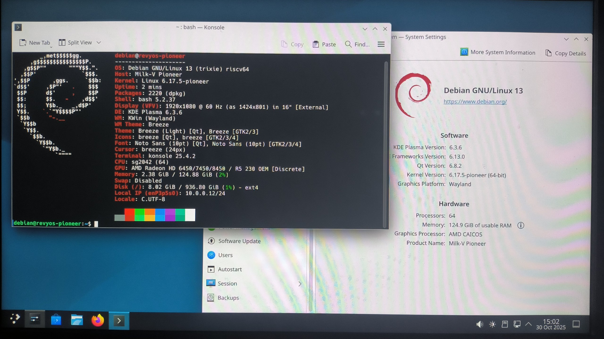

# RevyOS Pioneer Test Report

## Test Environment

### Operating System Information

- System Version: RevyOS 20251030
- Download Link: [https://fast-mirror.isrc.ac.cn/revyos/extra/images/sg2042/20251030/](https://fast-mirror.isrc.ac.cn/revyos/extra/images/sg2042/20251030/)
  - Firmware: [https://fast-mirror.isrc.ac.cn/revyos/extra/images/sg2042/20251030/](https://fast-mirror.isrc.ac.cn/revyos/extra/images/sg2042/20251030/)
- Reference Installation Document: [https://docs.revyos.dev/docs/Installation/milkv-pioneer/](https://docs.revyos.dev/docs/Installation/milkv-pioneer/)

### Hardware Information

- Milk-V Pioneer Box v1.3
- A microSD card
- NVME SSD and Reader
- HDMI cable + monitor

## Installation Steps

### Flashing Firmware

#### SD card (suggest for fist-time)

Get the firmware and flash to the SD card:
```bash
wget https://fast-mirror.isrc.ac.cn/revyos/extra/images/sg2042/20251030/firmware_sg2042-single-sg2042-upstream-v6.17.y-sg204x-v1.7.img
sudo dd if=firmware_sg2042-single-sg2042-upstream-v6.17.y-sg204x-v1.7.img of=/dev/your/sd/card
sync
```

Insert the SD card into the Pioneer Box.

#### SPI Flash

To flash the SPI flash, you need to have a running system on Pioneer Box.

Install mtd relative software:
```bash
sudo apt install mtd-utils
sudo modprobe mtdblock
```

Download and flash into SPI Flash **Notice this time the firmware ends with `.bin`**
```bash
wget https://fast-mirror.isrc.ac.cn/revyos/extra/images/sg2042/20251030/firmware_sg2042-single-sg2042-upstream-v6.17.y-sg204x-v1.7.bin
sudo flashcp -v firmware_sg2042-single-sg2042-upstream-v6.17.y-sg204x-v1.7.bin /dev/mtd1
```

### Flashing Image

Decompress the image using `zstd`.
Write the image to the microSD card using `dd`.

```bash
zstd -d /path/to/revyos-pioneer-20251030-004123.img.zst
dd if=/path/to/revyos-pioneer-20251030-004123.img.zst of=/dev/yout-device bs=4M status=progress
```

### Common Issues

- To boot from the SD card, manually add Fip.bin and ZSBL to it.
- If you see random mess from serial port, which means you probably needs to update your firmware.

### Logging into the System

Logging into the system via the graphical interface.

Default username: `debian`
Default password: `debian`

## Expected Results

The system boots up normally and allows login through the graphical interface.

## Actual Results

The system boots up normally and login through the graphical interface is successful.

### Boot Log

```log
Linux revyos-pioneer 6.17.5-pioneer #2025.10.24.07.33+1a3936919 SMP Fri Oct 24 08:22:44 UTC 2025 riscv64

The programs included with the Debian GNU/Linux system are free software;
the exact distribution terms for each program are described in the
individual files in /usr/share/doc/*/copyright.

Debian GNU/Linux comes with ABSOLUTELY NO WARRANTY, to the extent
permitted by applicable law.
debian@revyos-pioneer:~$ fastfetch
        _,met$$$$$gg.          debian@revyos-pioneer
     ,g$$$$$$$$$$$$$$$P.       ---------------------
   ,g$$P""       """Y$$.".     OS: Debian GNU/Linux 13 (trixie) riscv64
  ,$$P'              `$$$.     Host: Milk-V Pioneer
',$$P       ,ggs.     `$$b:    Kernel: Linux 6.17.5-pioneer
`d$$'     ,$P"'   .    $$$     Uptime: 32 mins
 $$P      d$'     ,    $$P     Packages: 2220 (dpkg)
 $$:      $$.   -    ,d$$'     Shell: bash 5.2.37
 $$;      Y$b._   _,d$P'       Display (IDVED11): 1920x1080 @ 60 Hz in 28" [External]
 Y$$.    `.`"Y$$$$P"'          Theme: Breeze [GTK2/3]
 `$$b      "-.__               Icons: breeze [GTK2/3/4]
  `Y$$b                        Font: Noto Sans (10pt) [GTK2/3/4]
   `Y$$.                       Cursor: breeze (24px)
     `$$b.                     Terminal: /dev/pts/0
       `Y$$b.                  CPU: sg2042 (64)
         `"Y$b._               GPU: AMD Radeon HD 6450/7450/8450 / R5 230 OEM [Discrete]
             `""""             Memory: 1.68 GiB / 124.88 GiB (1%)
                               Swap: Disabled
                               Disk (/): 8.01 GiB / 936.80 GiB (1%) - ext4
                               Local IP (enP3p5s0): 10.0.0.12/24
                               Locale: C

                                                       
                                                       
debian@revyos-pioneer:~$ uname -a
Linux revyos-pioneer 6.17.5-pioneer #2025.10.24.07.33+1a3936919 SMP Fri Oct 24 08:22:44 UTC 2025 riscv64 GNU/Linux
debian@revyos-pioneer:~$
```




Serial logs (from flashing the system to booting up):

[](https://asciinema.org/a/wtn7JGIWTSIlLSNmscCBgctCR)

## Test Criteria

Successful: The actual result matches the expected result.

Failed: The actual result does not match the expected result.

## Test Conclusion

Test successful.
